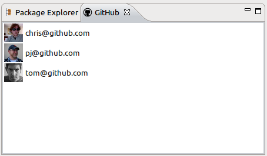

Eclipse Gravatar Plug-in
======

This is a plug-in to add [Gravatar](http://www.gravatar.com) support to Eclipse.

The org.avatar.github plug-in contains a persistent store of fetched Gravatar images
that can be used directly to get Image/ImageData instances for a specific hash or e-mail address.

This plug-in also contains LabelProvider and WorkbenchAdapter classes that provide images for
objects that can provide a hash.

Fetching an avatar from the plug-in store
------

    Avatar avatar = AvatarPlugin.getDefault().getAvatars().loadAvatarByEmail("name@example.com");
    Image image = avatar.getScaledImage(32);

Getting a cached avatar from the plug-in store
------

    Avatar avatar = AvatarPlugin.getDefault().getAvatars().getAvatarByEmail("name@example.com");
    Image image = avatar.getScaledImage(32);

Creating a table viewer with Gravatar images
------

    TableViewer viewer = new TableViewer(parent, SWT.H_SCROLL | SWT.V_SCROLL);
    viewer.setContentProvider(new ArrayContentProvider());
    viewer.setLabelProvider(new AvatarLabelProvider(viewer));
    //Replace with a valid e-mail address
    viewer.setInput(new Object[] { "name@example.com" });
